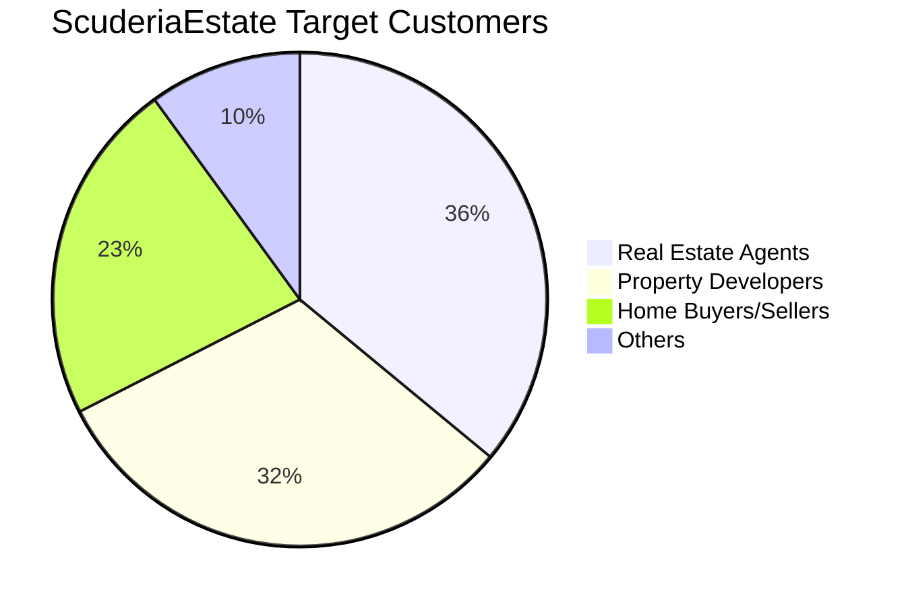
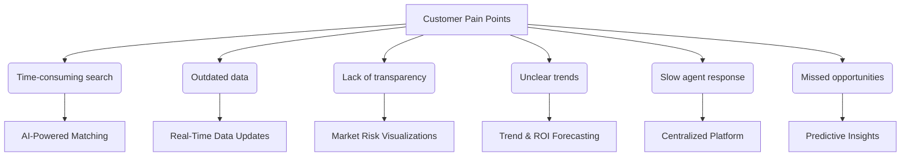

# ScuderiaEstate Execution Report 

## ScuderiaEstate Pitch Desk Presentation 

[Click here to view the presentation on Google Slides](https://docs.google.com/presentation/d/11KkG5xj1vkZ622lKEnxMnsd5oPqY6OUPHs0R4FBtbwY/edit?usp=sharing)

## ScuderiaEstate Product Demo 

(Turn on Audio 🔊)

https://github.com/user-attachments/assets/9c524d25-c1c7-4d58-90fc-ed15b547f65e
## Who is our customer? 

ScuderiaEstate serves three core customer groups within the real estate sector:

| **Customer**             | **Value Proposition**                                                                 |
|--------------------------|--------------------------------------------------------------------------------------------------|
| Real Estate Agents       | To access real-time pricing trends and property insights, enabling better listings and faster deals. |
| Property Developers      | To compare property values across locations and forecast growth for strategic development planning. |
| Home Buyers & Sellers    | To make more informed decisions using AI-driven property valuations and market intelligence.     |

These groups share a need for accurate property valuation and data-driven decision-making. By providing smart analytics and predictive tools, ScuderiaEstate addresses the rising demand for market transparency among local and international buyers, while helping industry professionals overcome the tech adoption gap.

Figure 1. ScuederiaEstate Target Customers

### Properties Price Trends in London and Opportunities 
Figure 2 demonstrates the annual changes in prime London property from 2013 to 2023. It showcased the market fluctuations, which demonstrated the volatile nature of the London housing market.  Understanding these trends is essential for making informed decisions for real estate agents, property developers, and home buyers or sellers. Real estate agents can time listings and set competitive prices, developers can assess growth areas and market timing, and buyers or sellers can evaluate the best moments to transact. Therefore, ScuderiaEstate addresses the key pain points across these sectors by delivering AI-powered insights and predictive analytics, empowering users to make faster, data-driven decisions based on real-time pricing trends and market dynamics.

Figure 2. Changes in property prices in Central London

## Customer Needs and Pain Points
Real estate professionals and buyers often face challenges such as outdated data, unclear market trends, and time-consuming searches, which may impact their ability to evaluate property, resulting in missed investment opportunities. The flowchart below highlights the key pain points in the industry and how ScuderiaEstate’s AI-driven platform directly addresses them.

Figure 3. Customer Needs and Pain Points

## How will our product meet the needs?
ScuderiaEstate is an intelligent, data-integrated platform designed to maximize accuracy and speed in real estate decision-making.

### 1. Smarter Search (Real-Time Data Updates + Centralized Platform)
With just one postcode input, ScuderiaEstate automatically collects and integrates current listings from multiple real estate platforms, displaying them intuitively on a map.
In a single view, users can compare prices, property types, bedroom counts, and floor areas—all in real time. This eliminates the effort and time normally spent navigating across different websites.

Figure 4. ScuderiaEstate Realtime Data Updates

### 2. AI-Powered Price Forecasting (Predictive Insights + ROI Forecasting)
ScuderiaEstate features a machine learning–based price prediction engine powered by XGBoost.
It analyzes public datasets from 1995 to 2024, incorporating factors such as:

- Most recent sale prices and local benchmarks
- Long-term market trends in the surrounding area
- Property size, age, and layout
- Number of sales and property type distribution

With this, the platform offers highly accurate future price projections, enabling smarter investment and timing decisions.

Figure 5. ScuderiaEstates Price Forecasting 

### 3. Making the Invisible Visible (Market Risk Visualization + Trend & ROI Forecasting)
ScuderiaEstate integrates data from multiple public APIs and sources to quantify the “feel” of a neighborhood.

- Crime data: Visualized on the map via UK Police API
- Price history: Displayed using Land Registry API
- Demographics: Insights into age groups, education, industry, religion, and language use, based on Nomis datasets

Whether you're an overseas investor or a first-time home buyer, ScuderiaEstate helps you understand an area like a local real estate expert.

Figure 6. ScuderiaEstate Market Risk Visualization 

### 4. Built on Trust and Transparency
Trust is a top concern for individual buyers and sellers. Scuderia Estate ensures that sensitive information is shared only after strict identity checks, as shown in Figure X.
Our service ensures transparency and trust through strict customer verification and robust data protection. We use a three step KYC process: starting with customer identification, followed by customer due diligence, and enhanced due diligence for high risk users. This allows only trusted customers to access our platform. In addition, personal data is protected with SSL/TLS during transmission and securely encrypted with AES after receipt. Regular audits guarantee strict GDPR compliance, ensuring that all user information remains private and secure.

Figure 7. Customer Screening and Privacy Protection

### 5.  Future Expansion (AI-Powered Matching and More)
We are planning to implement the following enhancements:

- Personalized property recommendations based on user preferences
- ROI simulation tools to estimate potential investment returns
- Multi-area comparisons and custom alerts

These features aim to support even more strategic and personalized decision-making.

## What is our unique selling proposition (USP)? 
While many platforms provide property-related data, they tend to serve only specific user groups—such as investors, developers, or landlords—and often come with complex interfaces, high subscription costs, or outdated designs. This creates barriers for first-time buyers and individual investors who need clarity and confidence when making property decisions. Scuderia Estate sets itself apart by offering a unified, user-friendly platform that brings together the most critical insights in one place. Figure X illustrates how existing platforms are positioned in relation to their target users and common limitations.

Figure 8. Competitor Positioning Overview

Our service integrates AI powered price forecasting, crime and environmental risk data, and demographic insights, which are often overlooked by competitors. Unlike platforms that require technical expertise or large budgets, Scuderia Estate is designed for accessibility, with an intuitive interface and affordable pricing that make it easy for anyone to use, whether on desktop or mobile. In a market where other services feel fragmented or overwhelming, Scuderia Estate delivers clarity, reliability, and smart technology in one seamless experience. This is clearly shown in Table 2.

Table 1. Feature Comparison Across Platforms
| Feature               | ScuderiaEstate | PropertyData | Nimbus Maps | LandInsight | Lendlord | Home.co.uk |
|-----------------------|----------------|---------------|--------------|--------------|-----------|--------------|
| Price (per month)     | Affordable for SMEs (Free for individuals) | £14+         | £80–150      | £45–135      | Free / £12 | Free         |
| Market Insights       | ✅             | ✅           | ✅           | ✅           | ❌        | ✅ (Basic) |
| Crime Data            | ✅             | ❌           | ❌           | ❌           | ❌        | ❌           |
| Beginner Friendly     | ✅             | ❌           | ❌           | ❌           | ✅        | ❌           |
| Mobile Friendly       | ✅             | ✅           | ❌           | ❌           | ✅        | ❌           |
| Investor Oriented     | ✅             | ✅           | ✅           | ✅           | ❌        | ❌           |

## Business Execution Summary
ScuderiaEstate has gone beyond ideation and taken concrete steps toward execution, including customer engagement, team structure, legal preparation, and marketing strategy development. Below is a summary of our progress so far and the planned next steps.

Figure 9. Business Plan Execution Timeline

### Achievements to Date
Since the launch of our business plan, we have made steady progress across multiple areas. We validated our concept through interviews with potential users and industry professionals, and refined our direction accordingly. Our team structure and roles were clearly defined to ensure smooth collaboration, and development has been managed through a centralised GitHub repository. We also prepared the legal groundwork for registering as a Limited Company, including compliance with GDPR and AML regulations. A functional prototype was developed with AI-driven features, and early feedback helped us improve usability. In addition, we began testing marketing strategies using Instagram and TikTok to explore user engagement and outreach potential.

### Next Steps
**Raise Minimal Viable Investment** :
We plan to secure the minimum necessary funding required for company registration and continued MVP development. Potential sources include university-affiliated incubators and pitch events.

**Agree on Board Structure and Shareholding** : 
To ensure transparency and sustainability, we will formalise the roles and responsibilities of board members and clarify the shareholding structure in preparation for incorporation.

### Sales & Marketing Execution Plan
As we move forward, our go-to-market strategy will play a crucial role. The following plan highlights how we intend to acquire, convert, and retain users from 2025 onward.

Table 2. Sales & Marketing Timeline

| Timeline                 | Strategy Category            | Key Activities                                                                                   | Purpose / Expected Outcome                                             |
|--------------------------|------------------------------|--------------------------------------------------------------------------------------------------|------------------------------------------------------------------------|
| **From Mid-April 2025**  | Initial User Acquisition     | - Launch ads on Instagram and TikTok    - Conduct user testing and interviews using prototype | Validate product-market fit (PMF)    Build early brand awareness    |
| **From Summer 2025**     | Monetization Begins          | - Offer 7-day free trial    - Introduce tiered pricing: Basic, Pro, Enterprise                 | Convert users to paying customers    Establish a revenue base       |
| **From Autumn 2025**     | Expansion Phase              | - Launch video ads on YouTube and LinkedIn    - Publish SEO blog content                      | Increase web traffic    Build credibility with professionals        |
| **From 2026 Onward**     | Retention & LTV Optimization | - Email marketing (newsletters, retargeting)    - Enhance community forum and customer support | Improve retention    Boost user satisfaction and loyalty            |
| **Any Time (Mid/Long-Term)** | Partnerships              | - Partner with real estate agents, mortgage brokers    - Exhibit at property expos and events  | Expand enterprise deals and reach via trusted partners                 |
| **Any Time (Mid/Long-Term)** | Affiliate & Referral       | - Offer referral rewards    - Collaborate with influencers through affiliate programs          | Boost user acquisition via word-of-mouth    Reduce CPA              |

### Future Vision
In addition to these next steps, we are preparing for long-term scalability. Our intellectual property is being secured through trademark registration in both the UK and the US to support brand protection and cross-border expansion. Once ScuderiaEstate reaches a valuation of £50 million, we aim to transition to a Public Limited Company (PLC) and pursue an IPO on the London Stock Exchange. Following this milestone, we plan to expand globally by establishing regional subsidiaries in Europe, the Middle East, and Asia to adapt to local markets while maintaining a unified global brand.

## Risks and Challenges
The three most critical risks we have identified are labour shortages, regulatory changes, and cybersecurity threats.
Each of these risks could have a serious impact on the continuity of our business if left unaddressed.
As shown in Table 3, we have developed both mitigation and contingency plans to reduce potential damage and ensure service stability.

Table 3. Key Risks and Mitigation Strategies

| Category         | Labour Shortages                                                                 | Regulatory Changes                                                                 | Cybersecurity Risks                                                                     |
|------------------|----------------------------------------------------------------------------------|-------------------------------------------------------------------------------------|------------------------------------------------------------------------------------------|
| Summary          | We may struggle to hire legal, AI, or security experts due to talent competition. | Policy shifts or legal action could reduce access to foreign investors or AI tools. | Mishandling sensitive data could lead to fraud, legal penalties, or loss of trust.       |
| Mitigation Plan  | We will offer remote work, stock options, and training to attract and develop talent. | We will hire legal advisors and ensure our AI is explainable and regularly audited. | We will implement strong KYC, monitor transactions with AI, and follow GDPR/AML rules.   |
| Contingency Plan | We will reassign staff, hire freelancers, or narrow service focus if needed.     | We will adapt our AI or pivot to safer markets like the UK and EU.                 | We will freeze accounts, notify regulators, and use cyber insurance to limit the impact. |

